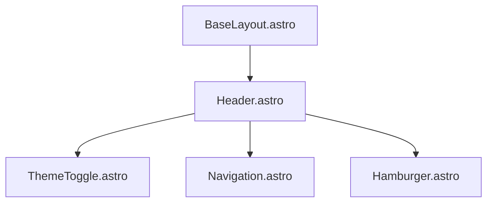
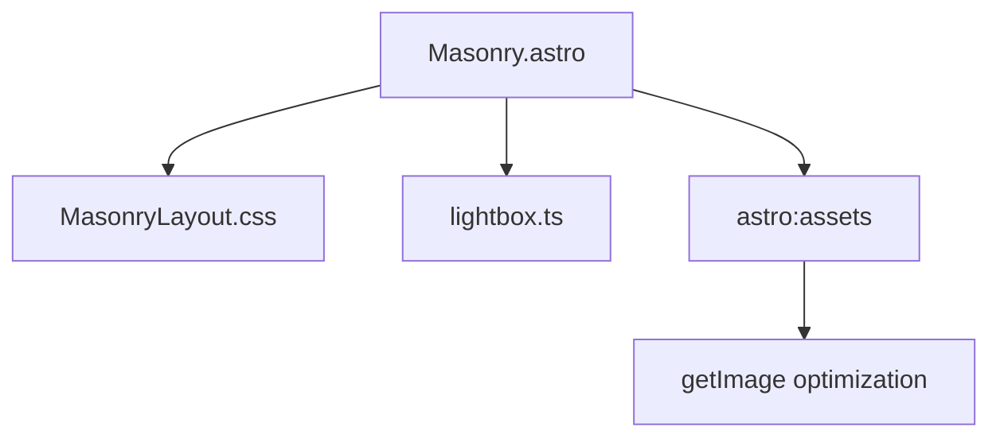
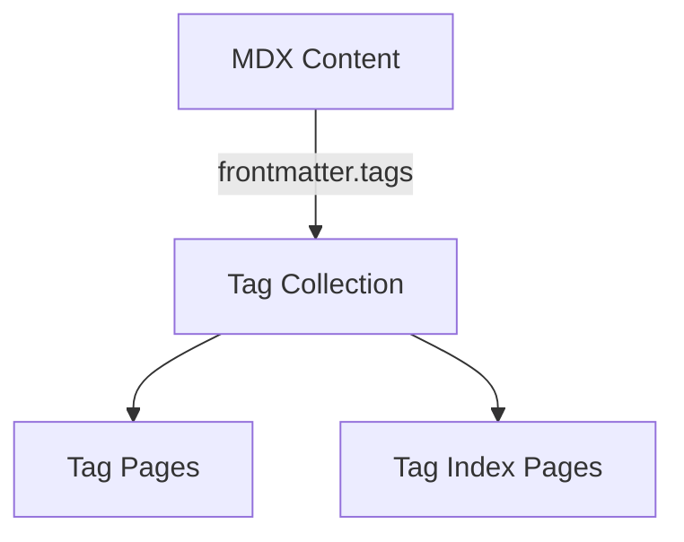

# Architecture Documentation

### Technical architecture of the Revista project

---

## Component Architecture

### Vanilla Island Patterns

All interactive components are vanilla Astro `.astro` files with inline `<script>` blocks. There is no React, no JSX, and no hydration directives.



### Key Integration Points

1. **ThemeToggle** (self-contained Astro component):
   - Inline SVG with CSS-driven dark-state visuals (ray opacity/scale, circle radius)
   - Dispatches `theme-toggle` custom event on click
   - `theme.ts` handles localStorage persistence and the `dark` class on `<html>`
   - `initTheme()` is called in the script block (idempotent -- safe across navigations)
   - All DOM hooks re-wire on `astro:page-load` for ClientRouter compatibility

2. **Hamburger** (vanilla Astro component):
   - 3-bar-to-X CSS transition animation
   - Escape key handler and click-outside-to-close
   - Cleanup closure removes document-level listeners before re-adding on navigation

3. **ScrollToTop** (vanilla Astro component):
   - rAF-throttled scroll listener with self-terminating loop
   - Transparent background with inherited-colour chevron
   - Smooth `window.scrollTo({ behavior: "smooth" })`

4. **HeroImage** (vanilla Astro component):
   - translate3d parallax with rAF+lerp loop
   - IntersectionObserver-gated (parallax only runs while visible)
   - Fade-in on image load, `prefers-reduced-motion` respect
   - Cleanup closure pattern for ClientRouter safety

```astro
---
// ThemeToggle.astro -- self-contained, no React wrapper
---

<button id="theme-toggle-btn" aria-label="Switch to dark theme">
  <svg><!-- sun/moon SVG with CSS-driven states --></svg>
</button>

<script>
  import { initTheme } from "../scripts/theme.ts";
  initTheme();

  document.addEventListener("astro:page-load", () => {
    const btn = document.getElementById("theme-toggle-btn");
    btn?.addEventListener("click", () => {
      window.dispatchEvent(new Event("theme-toggle"));
    });
  });
</script>
```

### State Management

- `theme.ts` owns the state (localStorage + DOM class)
- Astro components are pure UI that dispatch events
- `astro:page-load` re-applies theme after View Transitions body swap
- No React state, no `useEffect`, no `MutationObserver` sync needed

## Masonry Image Grid Implementation

The Masonry layout is a key visual feature of the site, implemented with CSS Grid rather than JavaScript-based libraries for better performance.

### Technical Implementation



### CSS Grid Configuration

```css
/* Key aspects of the Masonry layout */
.masonry {
  display: grid;
  grid-template-columns: repeat(auto-fill, minmax(200px, 1fr));
  gap: 12px;
  grid-auto-flow: dense;
}

/* Variable sizing for visual interest */
.image-container:nth-child(3n) {
  grid-row: span 2; /* Every 3rd image spans 2 rows */
}

.image-container:nth-child(4n) {
  grid-column: span 2; /* Every 4th image spans 2 columns */
}

/* Responsive adjustments */
@media (max-width: 768px) {
  .masonry {
    grid-template-columns: repeat(auto-fill, minmax(150px, 1fr));
  }

  /* Reset spanning on smaller screens */
  .image-container:nth-child(3n),
  .image-container:nth-child(4n) {
    grid-row: auto;
    grid-column: auto;
  }
}
```

### Image Processing Pipeline

1. **Image Collection**: Images are specified in MDX frontmatter
2. **Optimization**: The `getImage` function from `astro:assets` processes each image:
   - Converts to AVIF format for better compression
   - Sets loading="lazy" for performance
   - Handles proper width/height attributes for CLS prevention
3. **Rendering**: Images are placed in the grid with CSS handling the layout
4. **Lightbox Integration**: A custom lightbox is attached for fullscreen viewing

## Custom Tailwind Configuration

The site uses a highly customized Tailwind configuration with specific breakpoints optimized for photography viewing.

### Custom Breakpoints

```css
/* src/styles/global.css @theme block */
--breakpoint-sm: 800px;
--breakpoint-md: 1200px;
--breakpoint-lg: 1900px;
--breakpoint-xl: 2500px;
```

These breakpoints were specifically chosen based on:

1. Common display sizes for photography viewing
2. Optimal image grid layouts at different widths
3. Text readability considerations

### Custom Utilities

Image focal-point overrides are applied directly as inline `style` attributes on `` elements (e.g., `style="object-position: center top 33.33%"`). No custom Tailwind utilities are needed.

## Content Schema and Validation

### CollectionName Type

`src/scripts/collections.ts` exports a `CollectionName` type — a union of all content collection keys (`"muses" | "short_form" | "long_form" | "zeitweilig" | "authors" | "cv"`). This type is used throughout layouts and pages wherever `getCollection()` is called with a dynamic collection name, because Astro's generated types require a literal union member, not a plain `string`.

### MDX remarkPlugins Behavior

The `mdx()` integration inherits `remarkPlugins` and `rehypePlugins` from the base `markdown` config. Plugins are listed once via `markdown.processor: unified({ remarkPlugins: [...], rehypePlugins: [...] })` -- MDX picks them up automatically. The MDX integration does not specify its own `remarkPlugins` array.

### Schema Definition Pattern

All content is validated using Zod schemas with the following pattern:

```typescript
// Shared base schema — all collections use this
const baseSchema = z.object({
  title: z.string(),
  slug: z.string().optional(),
  tags: z.array(z.string()),
  author: z.string(),
  description: z.string(),
  image: z
    .object({
      src: z.string(),
      alt: z.string(),
      positionx: z.string().optional(),
      positiony: z.string().optional(),
    })
    .optional(),
  pubDate: z.coerce.date(),
  updatedDate: z.coerce.date().optional(),
});

const muses = defineCollection({
  loader: glob({ pattern: "**/[^_]*.mdx", base: "./src/content/muses" }),
  schema: baseSchema,
});

// CV extends the base with professional fields
const cv = defineCollection({
  loader: glob({ pattern: "**/[^_]*.mdx", base: "./src/content/cv" }),
  schema: baseSchema.extend({ fullName: z.string().optional() /* ... */ }),
});
```

### Glob Pattern Selection

The `loader: glob({ pattern: "**/[^_]*.mdx", base: "./src/content/muses" })` configuration:

1. `**/` - Recursively searches all subdirectories
2. `[^_]*` - Ignores files that start with underscore (draft content)
3. `.mdx` - Only selects MDX files
4. `base: "./src/content/muses"` - Sets the root directory for the collection

This provides a way to:

- Organize content in subdirectories (e.g., by year, category)
- Keep draft content in the same directory but excluded from builds
- Apply consistent schemas to all content in a collection

## Image Optimization Strategy

1. **Astro image service**: The [`@erfianugrah/astro-image-hq`](https://www.npmjs.com/package/@erfianugrah/astro-image-hq) custom Astro image service (profile `photo`) handles production builds, with a `noop` service fallback in dev. Configured in `astro.config.mjs`; handles AVIF/WebP conversion, responsive sizing, and proper metadata.

2. **CDN integration** for external assets via `image.erfi.io`.

3. **Loading optimizations**:
   - `loading="lazy"` for below-the-fold images
   - Proper sizing attributes to prevent layout shifts
   - Prefetching of critical images

## Tag System Architecture



The tag system works as follows:

1. **Tag Definition**: Each content piece includes tags in its frontmatter

   ```yaml
   ---
   title: "Example Post"
   tags: ["photography", "urban", "monochrome"]
   ---
   ```

2. **Tag Extraction**: During build, Astro extracts all unique tags

   ```javascript
   export async function getStaticPaths() {
     const posts = await getCollection("muses");
     const tags = [...new Set(posts.flatMap((post) => post.data.tags))].sort();

     return tags.map((tag) => ({
       params: { tag },
       props: {
         posts: posts.filter((post) => post.data.tags.includes(tag)),
         tag,
       },
     }));
   }
   ```

3. **Route Generation**: Creates dynamic routes for each tag
   - `/muses/tags/[tag].astro` → `/muses/tags/monochrome`
   - `/long_form/tags/[tag].astro` → `/long_form/tags/travel`

4. **Content Association**: Each tag page displays all content with that tag

This architecture allows for:

- Cross-collection tagging
- Automatic tag page generation
- Consistent tag URLs across the site
